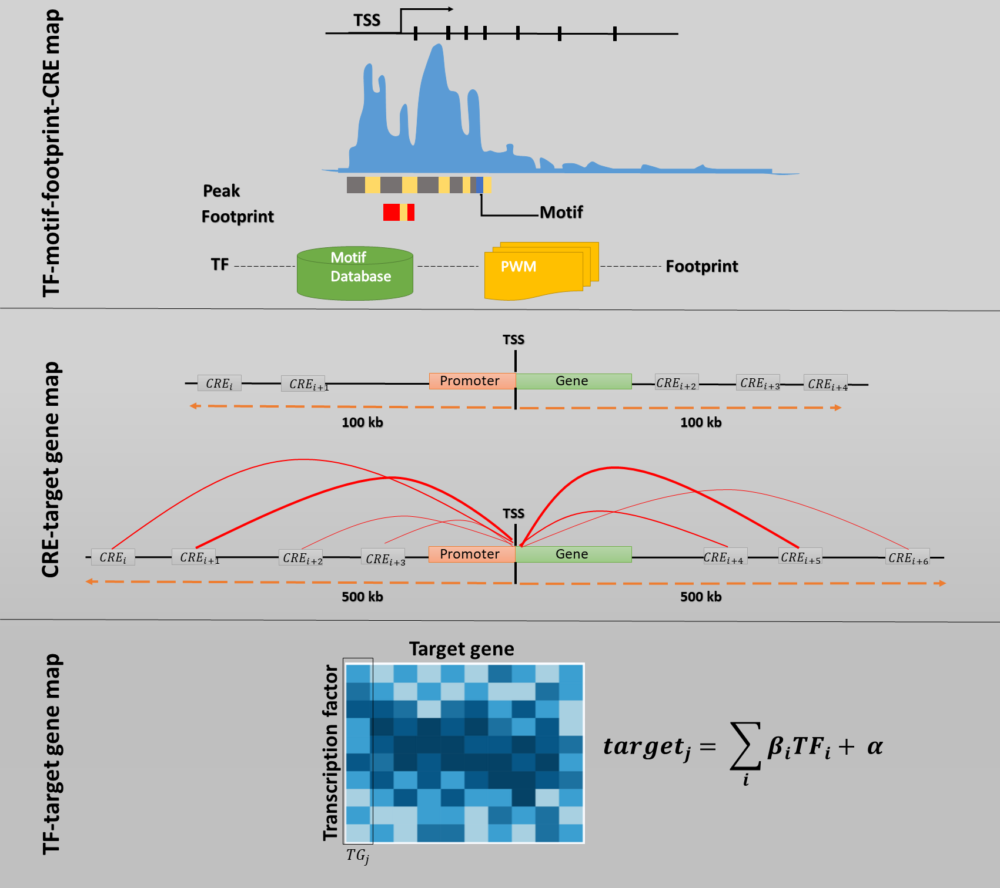

# TRe-NET
## Reconstructing transcriptional regulatory networks with single-cell multi-omics data

Single cell technologies provide a rich source of information for deciphering the gene regulatory networks (GRNs) at cell type level. Whilst many methods exist for single cell GRN inference, many of these methods are primarily based on transcriptomic data and does not incorporate information from distal regulatory regions to model their contribution to gene regulation of an individual cell type. Here, we present TRe-NET, a pipeline to identify transcription factor – target gene links from joint profiles of single cell gene expression and chromatin accessibility data at cell type level. First, using the single cell ATAC-seq data we identify active transcription factor binding sites and their potential target genes. Then putative transcription factors for target genes are identified using a machine learning method based on least absolute shrinkage and selection operator (LASSO) from single cell RNA-seq data. Subsequently, we construct cell type specific transcriptional regulatory networks and identify key transcription factors controlling cell reprogramming. Using hair follicle differentiation as a use case to introduce this method, we further demonstrate that the regulons inferred by Tre-NET are associated with biologically defined cell types. Overall, Tre-NET improves the accuracy of inferring transcription factor – target gene links compared to other state of the art GRN inference methods.

 <div align="center">
 
 </div>
 
For the purpose of this demonstration we use the Single Cell Multiome ATAC + Gene Expression dataset of embryonic E18 mouse brain 5k cell provided by [10x Genomics](https://support.10xgenomics.com/single-cell-multiome-atac-gex/datasets/2.0.0/e18_mouse_brain_fresh_5k?).

First and foremost, we perform pre-processing using Seurat and Signac R packages.

```r
library(Signac)
library(Seurat)
library(EnsDb.Mmusculus.v79)
library(BSgenome.Mmusculus.UCSC.mm10)

set.seed(1234)

# load the RNA and ATAC data
counts <- Read10X_h5("Cortex/Data/e18_mouse_brain_fresh_5k_filtered_feature_bc_matrix.h5")
fragpath <- "Cortex/Data/e18_mouse_brain_fresh_5k_atac_fragments.tsv.gz"

# get gene annotations for hg38
annotation <- GetGRangesFromEnsDb(ensdb = EnsDb.Mmusculus.v79)
seqlevelsStyle(annotation) <- "UCSC"

# create a Seurat object containing the RNA adata
cortex <- CreateSeuratObject(
  counts = counts$`Gene Expression`,
  assay = "RNA"
)

# create ATAC assay and add it to the object
cortex[["ATAC"]] <- CreateChromatinAssay(
  counts = counts$Peaks,
  sep = c(":", "-"),
  fragments = fragpath,
  annotation = annotation
)

## Quality control
DefaultAssay(cortex) <- "ATAC"

cortex <- NucleosomeSignal(cortex)
cortex <- TSSEnrichment(cortex)

VlnPlot(
  object = cortex,
  features = c("nCount_RNA", "nCount_ATAC", "TSS.enrichment", "nucleosome_signal"),
  ncol = 4,
  pt.size = 0
)

# filter out low quality cells
cortex <- subset(
  x = cortex,
  subset = nCount_ATAC < 100000 &
    nCount_RNA < 25000 &
    nCount_ATAC > 1000 &
    nCount_RNA > 1000 &
    nucleosome_signal < 2 &
    TSS.enrichment > 1
)
cortex

#### Peak calling
# call peaks using MACS2
peaks <- CallPeaks(cortex, macs2.path = "/home/s4566105/miniconda3/envs/r_env/bin/macs2")

# remove peaks on nonstandard chromosomes and in genomic blacklist regions
peaks <- keepStandardChromosomes(peaks, pruning.mode = "coarse")
peaks <- subsetByOverlaps(x = peaks, ranges = blacklist_mm10, invert = TRUE)

# quantify counts in each peak
macs2_counts <- FeatureMatrix(
  fragments = Fragments(cortex),
  features = peaks,
  cells = colnames(cortex)
)

# create a new assay using the MACS2 peak set and add it to the Seurat object
cortex[["peaks"]] <- CreateChromatinAssay(
  counts = macs2_counts,
  fragments = fragpath,
  annotation = annotation
)

## Gene expression data processing
DefaultAssay(cortex) <- "RNA"
cortex <- SCTransform(cortex)
cortex <- RunPCA(cortex)

## DNA accessibility data processing
DefaultAssay(cortex) <- "peaks"
cortex <- FindTopFeatures(cortex, min.cutoff = 5)
cortex <- RunTFIDF(cortex)
cortex <- RunSVD(cortex)
```
Next choose a set of candidate genes for construction the GRNs.
Here we consider only genes with at least 5% expression across all cells. 

```r
### identify the genes expressed at least across 5% of the cells
cortex_counts <- as.matrix(cortex@assays$RNA@counts)

perc.zero <- 0.05
cortex_counts <- cortex_counts[apply(cortex_counts, 1, 
                             function(x){sum(x == 0)}) < ncol(cortex_counts)*(1-perc.zero),]

cortex_expr_TFs <- rownames(cortex_counts)
```

TRe-NET consists of three core components:

### TF-motif-footprint-CRE map
For constructing the TF-motif-footprint-CRE map, we followed the approach proposed in [IReNA-v2](https://www.sciencedirect.com/science/article/pii/S221112472101473X?via%3Dihub)

```r
# Some of the following code have been adopted from https://github.com/Pinlyu3/IReNA-v2 and changed to suit our data and objectives.

################ Identifying the footprints ##################
### run TOBIAS 
### the insertion sites for each fragment file output from the cellranger-atac have already been corrected 
### change the parameter of --read_shift

nohup TOBIAS ATACorrect --read_shift 0 0 --bam ATAC_seq/e18_mouse_brain_fresh_5k_atac_possorted_bam.bam --genome ATAC_seq/mm10.fa --peaks ATAC_seq/e18_mouse_brain_fresh_5k_atac_peaks.bed --blacklist ATAC_seq/mm10_blacklist.bed --outdir footprint/e18_mouse_brain_fresh_5k --cores 12

source('Code/R_functions/Step4_functions.R')


# Calculate the footprint scores including NC, NL and NR for each motif's binding region
### first convert normalized bw files to GRanges and save/output
file = 'Cortex/footprint/e18_mouse_brain_fresh_5k/e18_mouse_brain_fresh_5k_atac_possorted_bam_corrected.bw'
savefile = 'Cortex/footprint/e18_mouse_brain_fresh_5k_signal'
Check_normalized_Signal(file,savefile)

# Convert all peaks file to GRanges object
# Read fragments file
bed <- as.data.frame(read.table("Cortex/ATAC_seq/e18_mouse_brain_fresh_5k_atac_peaks.bed",header = FALSE, sep="\t",stringsAsFactors=FALSE, quote=""))

library('GenomicRanges')

# Convert all peaks to a GenomicRanges object
All_peaks_GR <- Read_peak_to_GR(bed)
save(All_peaks_GR, file = "Cortex/RObjects/All_peaks_GR.rds")

### load the motifs pwm matrix 
load("Networks/scATAC-seq/PWM_list_combine_cl")

### load the mm10 genome sequence
library(motifmatchr)
library('BSgenome.Mmusculus.UCSC.mm10')

cortex_peaks <- rownames(cortex@assays$peaks)
cortex_peaks_GR <- StringToGRanges(cortex_peaks)

### find the motifs in the peaks
### convert the results of motifmatchr to a GRanges object
Total_footprint_Motif = matchMotifs(PWM_list_combine_cl, cortex_peaks_GR, genome = BSgenome.Mmusculus.UCSC.mm10, out='positions', p.cutoff = 5e-05)

Total_footprint_Motif_GR = Must_to_GR(Total_footprint_Motif)
save(Total_footprint_Motif_GR, file = "Cortex/RObjects/Total_footprint_Motif_GR.rds")
load("Cortex/RObjects/Total_footprint_Motif_GR.rds")

### filter these motif binding region (Total_footprint_Motif_GR) by footprint scores

### load the motifs names and their corresponding TFs name
### out_all_ext: col1: Motif col2: TFs 
load("R:/METF2020-Q1816/Networks/scATAC-seq/out_all_ext")


# First filter out the footprints if their corresponding gene expression are not 
# enriched in their cell type
# for each cell type, we are only interest in the TFs expressed across at least 5% of the cells.

### read signal files
e18_mouse_brain_fresh_5k_signal = readRDS('Cortex/footprint/e18_mouse_brain_fresh_5k_signal')


#### We removed the motifs binding for each cell type if the expression level of their corresponding TFs are not enriched in that cell type
#### Then we calulated the NC, NL and NR for each motifs binding region with the cell-type specific signal #####
Early_e18_mouse_brain_fresh_5k_footprints = Calculate_footprint_celltypes(Total_footprint_Motif_GR, e18_mouse_brain_fresh_5k_signal, cortex_expr_TFs, out_all_ext)

### Further filtered TFs' binding region if their binding score don't meet: NC < -0.1 and NL > 0.1 and NR > 0.1.
Early_e18_mouse_brain_fresh_5k_footprints_cl = Filter_footprints(Early_e18_mouse_brain_fresh_5k_footprints, delta = 0.1)

#### save the results of Step4
save(Early_e18_mouse_brain_fresh_5k_footprints, file = "Cortex/footprint/Early_e18_mouse_brain_fresh_5k_footprints")
save(Early_e18_mouse_brain_fresh_5k_footprints_cl, file = "Cortex/footprint/Early_e18_mouse_brain_fresh_5k_footprints_cl")
```

### CRE-target gene map

In this step significant CRE – gene associations are identified as; (a) CREs situated in known promoter regions; (b) CRE – gene links with significant Spearman correlation (P-value < 0.05 and Spearman correlation coefficient ρ > |0.05|) ; (c) CREs situated within 100 kb upstream or downstream of known TSS. 

```r
### Linking peaks to genes

#### (a) CREs situated in known promoter regions
library(EnsDb.Mmusculus.v79)

gene.ranges <- genes(EnsDb.Mmusculus.v79)
gene.ranges <- gene.ranges[gene.ranges$gene_biotype == 'protein_coding', ]
gene.ranges <- keepStandardChromosomes(gene.ranges, pruning.mode = 'coarse')
seqlevelsStyle(gene.ranges) <- 'UCSC'
gene.promoters <- promoters(gene.ranges, upstream=2000, downstream=200, use.names=TRUE)


# Find which promoters overlap a peak in the mouse cortex data
library(GenomicRanges)
library(S4Vectors)
library(Seurat)
library(Signac)

# load full data object
load("Cortex/RObjects/cortex.rds")

peaks <- StringToGRanges(regions = rownames(cortex), sep = c(":", "-"))
hits <- findOverlaps(query = peaks, subject = gene.promoters)

promoter.peaks <- Matrix::sparseMatrix(
  i = queryHits(x = hits),
  j = subjectHits(x = hits),
  x = 1,
  dims = c(length(x = peaks), length(x = gene.ranges))
)

sep = c(":", "-")

rownames(x = promoter.peaks) <- GRangesToString(grange = peaks, sep = sep)
colnames(x = promoter.peaks) <- gene.ranges$gene_name

xy_rowsums <- as.matrix(rowSums(promoter.peaks))

promoter_peak_gene <- NULL

for (i in 1:nrow(promoter.peaks)) {
  
  tg_genes <- promoter.peaks[i,] 
  tg_names <- names(tg_genes[tg_genes>0])
  
  promoter_peak_gene_df <- data.frame(TF = rep(rownames(promoter.peaks)[i], each = length(tg_names)),
                                      TG = tg_names) 
  promoter_peak_gene <- rbind(promoter_peak_gene, promoter_peak_gene_df)
}

save(promoter_peak_gene, file = "Cortex/Target_genes/promoter_peak_gene.rds")

#### (b) CRE – gene links with significant Spearman correlation (P-value < 0.05 and Spearman correlation coefficient ρ > |0.05|) 
DefaultAssay(cortex) <- "peaks"

# first compute the GC content for each peak
cortex <- RegionStats(cortex, genome = BSgenome.Mmusculus.UCSC.mm10)

cortex_links_spearman <- gene_peak_speaCor(object = cortex,
                                           peak.assay = "peaks",
                                           expression.assay = "RNA")

cortex_links_spearman <- as.data.frame(links)  
save(cortex_links_spearman, file = "Cortex/Links/cortex_links_spearman.rds")

#### (c) CREs situated within 100 kb upstream or downstream of known TSS
#### Select genes that overlap between 100kb of the gene body
# Get TSS for the genes
tss <- resize(x = gene.ranges, width = 1, fix = 'start')

# Associate each selected TSS of the selected genes to the
# TSS of genes within (+/-) 5000 kb 
pro_peaks_genes <- Extend(x = tss, upstream = 100000, downstream = 100000)
pro_TSS_genes <- findOverlaps(query = peaks, subject = pro_peaks_genes) 
pro_TSS_genes_hit_mat <- Matrix::sparseMatrix(
  i = queryHits(x = pro_TSS_genes),
  j = subjectHits(x = pro_TSS_genes),
  x = 1,
  dims = c(length(x = peaks), length(x = pro_peaks_genes))
)

sep = c(":", "-")

rownames(x = pro_TSS_genes_hit_mat) <- GRangesToString(grange = peaks, sep = sep)
colnames(x = pro_TSS_genes_hit_mat) <- pro_peaks_genes$gene_name

head(pro_TSS_genes_hit_mat)

yz <- as.matrix(rowSums(pro_TSS_genes_hit_mat))

body_peak_gene <- NULL

for (i in 1:nrow(pro_TSS_genes_hit_mat)) {
  
  tg_genes <- pro_TSS_genes_hit_mat[i,] 
  tg_names <- names(tg_genes[tg_genes>0])
  
  body_peak_gene_df <- data.frame(TF = rep(rownames(pro_TSS_genes_hit_mat)[i], each = length(tg_names)),
                                  TG = tg_names) 
  body_peak_gene <- rbind(body_peak_gene, body_peak_gene_df)
}

save(body_peak_gene, file = "Cortex/Target_genes/body_peak_gene.rds")

#### Combining results from all three ways
corr_peak_gene <- data.frame(TF = cortex_links_spearman$peak,
                             TG = cortex_links_spearman$gene)

# create a peaks to links object combining results from all three above
peak_gene_links <- rbind(promoter_peak_gene, body_peak_gene, corr_peak_gene)

peak_gene_links <- peak_gene_links[!duplicated(peak_gene_links[ ,c("TF", "TG")]), ] 

dim(peak_gene_links)

colnames(peak_gene_links) <- c("peaks", "TG")
save(peak_gene_links, file = "Cortex/Target_genes/peak_gene_links.rds")
```

### TF-target gene map

Now the above two maps can be merged to create the TF-target gene map.

```r
load("Cortex/footprint/Early_e18_mouse_brain_fresh_5k_footprints_cl")
load("Cortex/Target_genes/peak_gene_links.rds")

# Convert peak-gene-links in to a GenomicRanges object
peak_gene_links_gr = Signac::StringToGRanges(regions = peak_gene_links$peaks, sep = c(":", "-"))
peak_gene_links_gr$Target = peak_gene_links$TG

Res_find <- tf_tg_map(Early_e18_mouse_brain_fresh_5k_footprints_cl, peak_gene_links_gr)

##### add TF names to it #######
##### one motif may corresponding to multiple TF genes #####
load("Networks/scATAC-seq/out_all_ext")
colnames(out_all_ext) = c('Motifs','expr_TFs')
Res_find_merge = merge(Res_find, out_all_ext)

dim(Res_find_merge)
Res_find_cortex <- Res_find_merge[Res_find_merge$Target %in% cortex_expr_TFs, ]
Res_find_cortex <- Res_find_cortex[Res_find_cortex$expr_TFs %in% cortex_expr_TFs, ]
Res_find_cortex <- Res_find_cortex [!duplicated(Res_find_cortex[c("Target","expr_TFs")]),]

save(Res_find_cortex, file = "Links/Res_find_cortex.rds")
```

Finally, we build a TF–gene regulatory network by modelling the association between target gene expression and the gene expression of regulatory candidate genes (TFs). TRe-NET utilizes a LASSO model to identify significant TF-target gene links and to infer the strength of the associations.

```r
##### Run the LASSO
library(Matrix)

cortex_mtx <- Matrix(cortex@assays$RNA@data, sparse = TRUE)
cortex_se <- CreateSeuratObject(counts = cortex_mtx)
cortex_se <- SCTransform(cortex_se, return.only.var.genes = FALSE, variable.features.n = 3000)

cortex_counts <- Matrix(cortex_se@assays$SCT@data, sparse = TRUE)

# subset cells corresponding to the cell type of interest and genes of interest
# This is not required as the TFs were anyway filtered for 5% expression and the 
# LASSO can deal with sparsity

library(ISLR)
library(glmnet)
library("selectiveInference")

##### Run the LASSO
### Couldn't implement this as a function yet!

cortex_genes <- cortex_expr_TFs

# Get the target genes
cortex_tg <- Res_find_cortex$Target
cortex_tg <- cortex_tg[!duplicated(cortex_tg)]

# check overlap of target genes with genes expressed in cortex cells
cortex_overlap <- intersect(cortex_tg, cortex_genes)


tg_tf_coef <- NULL

system.time(for (i in 1:length(cortex_tg)){
  
  cortex_TG_df <- Res_find_cortex[Res_find_cortex$Target %in% cortex_tg[i], ]
  
  y <- cortex_counts[rownames(cortex_counts) %in% cortex_TG_df$Target, ]
  
  X <- as.matrix(t(cortex_counts[rownames(cortex_counts) %in% cortex_TG_df$expr_TFs, ]))
  xNames <- cortex_TG_df$expr_TFs
  
  if(length(xNames) == 1) {
    
    X = Matrix(t(X), sparse = TRUE)
    Y = Matrix(y, sparse = TRUE)
    coef.result <- qlcMatrix::corSparse(X = X, Y = Y)
    
    corr_df <- data.frame(s1 = NA,
                          TF = cortex_TG_df$expr_TFs,  
                          partial_RC = coef.result,
                          p_value = "Pearson",
                          L_CI = NA,
                          U_CI = NA, 
                          TG = xNames
    )
    
    tg_tf_coef <- rbind(tg_tf_coef, corr_df)
  }
  else{
    
    model_lasso <- cv.glmnet(x = X, y = y, standardize = FALSE, family = "gaussian", 
                             intercept = TRUE, alpha = 1, nfolds = 10)
    
    ## Extract coefficients at the error-minimizing lambda
    best_lasso_coef1 <- coef(model_lasso, s = model_lasso$lambda.min, exact = TRUE)[-1]
    
    # save co-efficients into data frame
    best_lasso_coef_mat <- as.data.frame(coef(model_lasso, s = model_lasso$lambda.min))
    best_lasso_coef_mat <- best_lasso_coef_mat[-1, , drop = FALSE]
    best_lasso_coef_mat <- best_lasso_coef_mat[!(best_lasso_coef_mat$s1 == 0), , drop = FALSE]
    best_lasso_coef_mat$TF <- rownames(best_lasso_coef_mat)
    
    n <- length(y)
    
    # Get the minimum lambda from CV for 
    lambda <- model_lasso$lambda.min
    
    if(nrow(best_lasso_coef_mat)>0){
      out <- fixedLassoInf(X, y, best_lasso_coef1, lambda*n)
      out_df <- data.frame(partial_RC = out$coef0,
                           p_value = out$pv,
                           out$ci,
                           TF = names(out$vars), 
                           row.names = names(out$vars)
      ) 
      colnames(out_df)[3:4] <- c("L_CI", "U_CI")
      
      # merge to the co-efficients dataframe
      best_lasso_coef_mat <- dplyr::left_join(best_lasso_coef_mat, out_df, by = "TF")
      best_lasso_coef_mat$TG <- rep(cortex_TG_df$Target[1], nrow(best_lasso_coef_mat))
      
      tg_tf_coef <- rbind(tg_tf_coef, best_lasso_coef_mat)
    }
    else{
      tg_tf_coef <- tg_tf_coef
    }
    
  }
  
})

cortex_TF_TG <- tg_tf_coef
save(cortex_TF_TG, file = "Networks/cortex_TF_TG.rds")
```

Get signficant tf - target gene associations from the LASSO

```r
cortex_TFs_groups <- cortex_TF_TG %>% 
  dplyr::group_by(TF) %>%
  dplyr::summarise(count_by_TFTG =  n())

# filter by p-value 
cortex_TF_TG_sig <- cortex_TF_TG[cortex_TF_TG$p_value < 0.05, ]
cortex_TF_TG_sig <- cortex_TF_TG_sig[complete.cases(cortex_TF_TG_sig), ]

cortex_TFs_grp_sig <- cortex_TF_TG_sig %>% 
  dplyr::group_by(TF) %>%
  dplyr::summarise(count_by_TFTG =  n())

cortex_TFs_grp_sig_asc <- cortex_TFs_grp_sig[order(cortex_TFs_grp_sig$count_by_TFTG, decreasing = TRUE), ]
```
